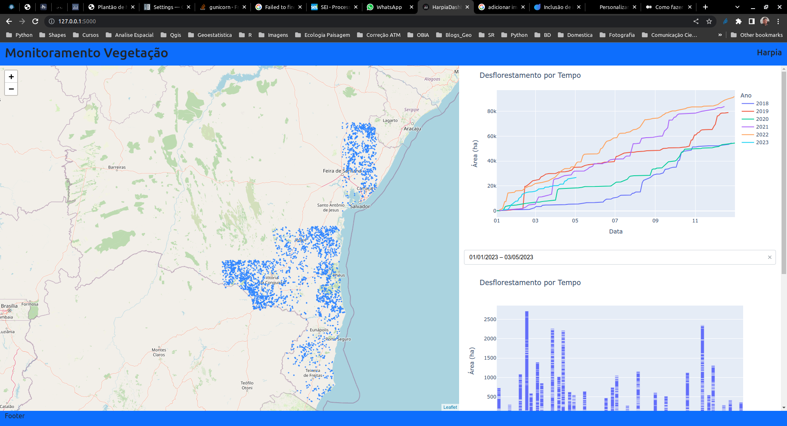

<h1 align="center"> Harpia DashBoard Project </h1>

# 🛠️ Configurando o projeto

**Criando as tabelas de cruzamento dos dados**
* Criando a tabela de cruzamentos entre municipio e desmatamento
  que deve existir no banco para leitura do dashboar

```sql
CREATE OR REPLACE VIEW public.vw_decremento_municipio
AS 
SELECT row_number() OVER () AS id, nome, view_date, round(((st_area(st_transform(t.geom, 5555)))/10000)::numeric, 2) AS area_ha
FROM (
	SELECT ms.nome AS nome,
		md.view_date,
		st_union(st_intersection(ms.geom, md.geom)) AS geom
	FROM limite.municipio_sei_2018 ms,
	monitoramento_dissolve md
	WHERE st_intersects(md.geom, ms.geom)
	GROUP BY nome, view_date
) t;
```

**Declarar as variáveis do ambiente**

* Editar os arquivos .env.dist removendo a extensão .dist
* Comfigure o workdir/.env (variavel utilizada pelo docker-compose) 

<h4 align="lefght">

	COMPOSE_PROJECT_NAME=harpia

</h4> 

* Declarar as variáveis de ambiente

<h4 align="lefght">

	# Parametros de conexão do banco de dados
	DB_USER='user_name' 
	DB_PASSWORD='password'
	DB_IP='host'
	DB_PORT='port'
	DB_NAME='db_name'

</h4> 

**Contruindo o contianer para rodar gunicorn**

```docker-compose
	cd workdir
	docker-compose build
	docker-compose up -d
```

Acessar o endereço que o gunicorn disponibiliza a aplicação: 127.0.0.1:5000

<p float="left">
 
</p>